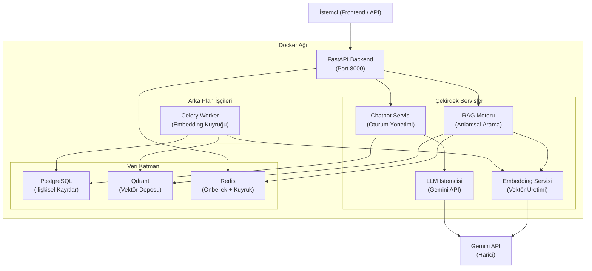
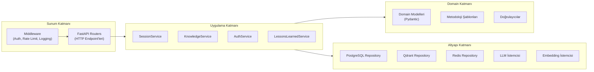
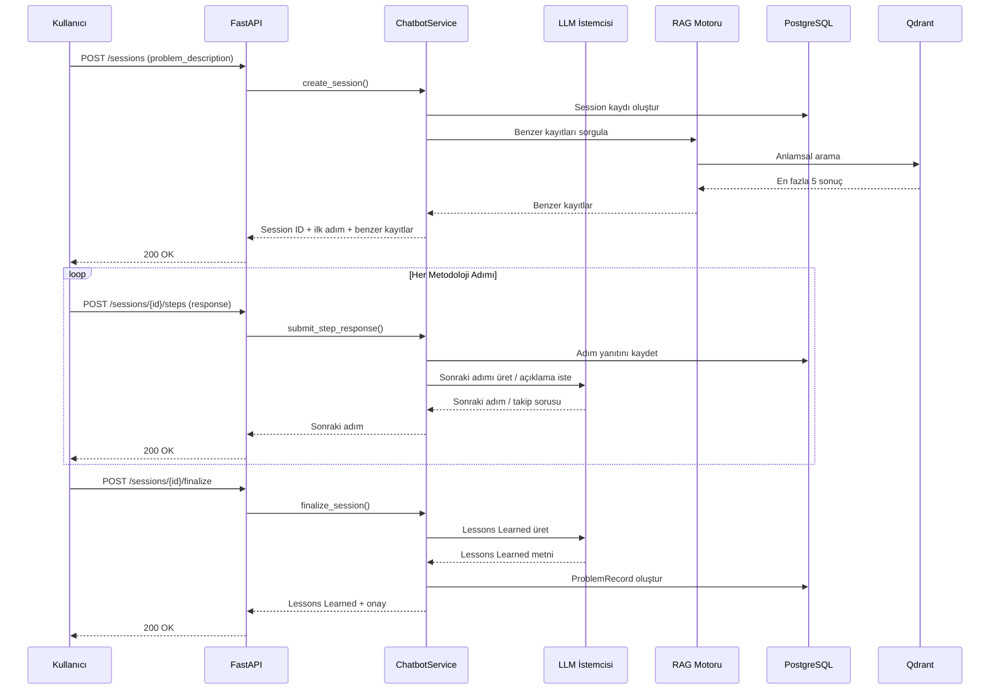
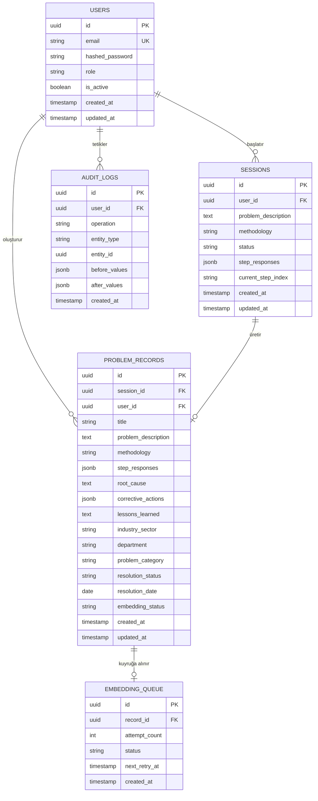

# Tasarım Dokümanı: Problem Bilgi Yönetim Sistemi

## Genel Bakış

Problem Bilgi Yönetim Sistemi (PBYS), endüstriyel sektörlerde (üretim, otomotiv, lojistik) karşılaşılan sorunların sistematik biçimde çözülmesini ve kurumsal hafızaya aktarılmasını sağlayan AI destekli bir platformdur.

Sistem iki temel işlevi yerine getirir:

1. **Rehberli Problem Çözme**: Chatbot arayüzü üzerinden Ishikawa, 8D, 5 Why ve PDCA metodolojilerini adım adım uygular.
2. **Bilgi Havuzu Yönetimi**: Tamamlanan oturumları "lessons learned" kayıtları olarak vektör tabanlı bilgi havuzuna işler; gelecekte benzer sorunlar için RAG (Retrieval-Augmented Generation) mimarisiyle anlamsal arama sağlar.

### Temel Tasarım Kararları

- **Qdrant** vektör deposu olarak seçilmiştir. ChromaDB prototipleme için uygun olsa da Qdrant'ın Rust tabanlı HNSW indeksleme, payload filtreleme ve production-grade ölçeklenebilirlik özellikleri bu sistemin gereksinimlerine daha uygundur.
- **Async-first mimari**: FastAPI + SQLAlchemy 2.0 async engine + asyncpg kombinasyonu, 50+ eşzamanlı oturum gereksinimini karşılamak için seçilmiştir.
- **Redis** hem oturum önbelleği hem de rate limiting için kullanılır.
- **Celery + Redis** embedding yeniden deneme kuyruğu için kullanılır (Gereksinim 6.4).

---

## Mimari

### Yüksek Seviye Mimari



### Katmanlı Mimari



### Oturum Akışı



---

## Bileşenler ve Arayüzler

### API Katmanı (FastAPI Routers)

| Router | Prefix | Sorumluluk |
|--------|--------|------------|
| `auth_router` | `/api/v1/auth` | Kimlik doğrulama, token yönetimi |
| `session_router` | `/api/v1/sessions` | Oturum CRUD, adım yönetimi |
| `knowledge_router` | `/api/v1/knowledge` | Bilgi havuzu arama ve sorgulama |
| `records_router` | `/api/v1/records` | Problem kaydı CRUD |
| `health_router` | `/api/v1` | `/health`, `/ready`, `/docs` |

### Servis Katmanı

#### `SessionService`
```python
class SessionService:
    async def create_session(user_id, problem_description, methodology) -> Session
    async def get_session(session_id) -> Session
    async def submit_step_response(session_id, step_index, response) -> StepResult
    async def go_back_step(session_id) -> StepResult
    async def finalize_session(session_id) -> FinalizeResult
    async def get_session_history(user_id, page, page_size) -> PaginatedSessions
```

#### `MethodologyEngine`
```python
class MethodologyEngine:
    def get_template(methodology_type: MethodologyType) -> MethodologyTemplate
    def get_step(template, step_index: int) -> Step
    def validate_response(step, response: str) -> ValidationResult
    def is_complete(template, responses: dict) -> bool
```

#### `RAGEngine`
```python
class RAGEngine:
    async def search_similar(query: str, filters: SearchFilters, top_k: int) -> list[SimilarRecord]
    async def index_record(record: ProblemRecord) -> None
    async def update_record(record_id: str, record: ProblemRecord) -> None
    async def delete_record(record_id: str) -> None
```

#### `EmbeddingService`
```python
class EmbeddingService:
    async def generate_embedding(text: str) -> list[float]
    async def generate_batch_embeddings(texts: list[str]) -> list[list[float]]
```

#### `LLMService`
```python
class LLMService:
    async def generate_clarification(step, response, attempt_count) -> str
    async def generate_next_why(why_chain: list[WhyQA]) -> str
    async def generate_lessons_learned(session: Session) -> str
    async def generate_ishikawa_summary(categories: dict) -> str
    async def suggest_category_reassignment(cause, current_category) -> CategorySuggestion
```

#### `KnowledgeService`
```python
class KnowledgeService:
    async def create_record(session: Session) -> ProblemRecord
    async def get_record(record_id: str) -> ProblemRecord
    async def update_record(record_id: str, updates: RecordUpdate) -> ProblemRecord
    async def delete_record(record_id: str) -> None
    async def list_records(filters, page, page_size) -> PaginatedRecords
    async def search_records(query: str, filters: SearchFilters) -> SearchResults
```

### Altyapı Katmanı

#### `PostgreSQLRepository`
- SQLAlchemy 2.0 async engine + asyncpg sürücüsü
- Bağlantı havuzu: min 5, max 20 bağlantı
- Tüm yazma işlemleri transaction içinde

#### `QdrantRepository`
- Qdrant Python istemcisi (async)
- Koleksiyon: `problem_records`
- Vektör boyutu: 768 (Gemini `text-embedding-004`)
- Mesafe metriği: Cosine similarity
- HNSW indeks parametreleri: `m=16`, `ef_construct=100`

#### `RedisRepository`
- Arama sonuçları önbelleği (TTL: 300 saniye)
- Rate limiting sayaçları (pencere: 60 saniye)
- Celery mesaj kuyruğu

---

## Veri Modelleri

### PostgreSQL Şeması



### Pydantic Domain Modelleri

```python
class MethodologyType(str, Enum):
    ISHIKAWA = "ishikawa"
    EIGHT_D = "8d"
    FIVE_WHY = "5why"
    PDCA = "pdca"

class SessionStatus(str, Enum):
    ACTIVE = "active"
    FINALIZED = "finalized"
    CANCELLED = "cancelled"

class EmbeddingStatus(str, Enum):
    PENDING = "pending"
    COMPLETED = "completed"
    FAILED = "failed"

class ProblemRecord(BaseModel):
    id: UUID
    session_id: UUID
    user_id: UUID
    title: str
    problem_description: str
    methodology: MethodologyType
    step_responses: dict[str, Any]
    root_cause: str
    corrective_actions: list[str]
    lessons_learned: str
    industry_sector: str | None
    department: str | None
    problem_category: str | None
    resolution_status: str
    resolution_date: date | None
    embedding_status: EmbeddingStatus
    created_at: datetime
    updated_at: datetime

class IshikawaData(BaseModel):
    man: list[str]
    machine: list[str]
    method: list[str]
    material: list[str]
    measurement: list[str]
    environment: list[str]

class WhyChain(BaseModel):
    questions: list[str]
    answers: list[str]
    root_cause: str

class EightDReport(BaseModel):
    d1_team: str
    d2_problem: str
    d3_containment: str
    d4_root_cause: str
    d5_corrective: str
    d6_implementation: str
    d7_prevention: str
    d8_closure: str
```

### API Yanıt Zarfı

```python
class APIResponse(BaseModel, Generic[T]):
    status: str                    # "success" | "error"
    data: T | None                 # Başarıda dolu, hatada null
    error: ErrorDetail | None      # Hatada dolu, başarıda null
    # Kural: data ve error'dan tam olarak biri null olmalıdır

class ErrorDetail(BaseModel):
    code: str
    message: str
```

### Problem Kaydı JSON Şeması

```json
{
  "$schema": "http://json-schema.org/draft-07/schema#",
  "title": "ProblemRecord",
  "type": "object",
  "required": ["id", "session_id", "user_id", "problem_description", "methodology",
               "step_responses", "root_cause", "corrective_actions", "lessons_learned",
               "resolution_status", "created_at", "updated_at"],
  "properties": {
    "id":                  { "type": "string", "format": "uuid" },
    "session_id":          { "type": "string", "format": "uuid" },
    "user_id":             { "type": "string", "format": "uuid" },
    "title":               { "type": "string" },
    "problem_description": { "type": "string", "minLength": 20, "maxLength": 2000 },
    "methodology":         { "type": "string", "enum": ["ishikawa", "8d", "5why", "pdca"] },
    "step_responses":      { "type": "object" },
    "root_cause":          { "type": "string" },
    "corrective_actions":  { "type": "array", "items": { "type": "string" } },
    "lessons_learned":     { "type": "string", "minLength": 100, "maxLength": 500 },
    "industry_sector":     { "type": ["string", "null"] },
    "department":          { "type": ["string", "null"] },
    "problem_category":    { "type": ["string", "null"] },
    "resolution_status":   { "type": "string" },
    "resolution_date":     { "type": ["string", "null"], "format": "date" },
    "embedding_status":    { "type": "string", "enum": ["pending", "completed", "failed"] },
    "created_at":          { "type": "string", "format": "date-time" },
    "updated_at":          { "type": "string", "format": "date-time" }
  },
  "additionalProperties": false
}
```

---

## Doğruluk Özellikleri (Correctness Properties)

*Bir özellik (property), sistemin tüm geçerli çalışmalarında doğru olması gereken bir karakteristik veya davranıştır — temelde sistemin ne yapması gerektiğine dair biçimsel bir ifadedir. Özellikler, insan tarafından okunabilir spesifikasyonlar ile makine tarafından doğrulanabilir doğruluk garantileri arasındaki köprüyü oluşturur.*


### Özellik 1: Problem Açıklaması Uzunluk Doğrulaması

*Herhangi bir* string girişi için, 20 ile 2000 karakter (dahil) arasındaki açıklamalar oturum oluşturmaya izin vermeli; bu aralığın dışındaki açıklamalar ise oturum oluşturmadan doğrulama hatası döndürmelidir.

**Doğrular: Gereksinim 1.1, 1.3, 1.4**

---

### Özellik 2: Oturum Tanımlayıcısı Benzersizliği

*Herhangi bir* N sayıda eşzamanlı oturum oluşturma isteği için, atanan tüm oturum tanımlayıcıları birbirinden farklı olmalıdır.

**Doğrular: Gereksinim 1.5**

---

### Özellik 3: RAG Sonuç Sayısı Sınırı

*Herhangi bir* geçerli problem açıklaması ile oturum oluşturulduğunda ve bilgi tabanı erişilebilir olduğunda, döndürülen benzer kayıt sayısı 0 ile 5 arasında (dahil) olmalıdır.

**Doğrular: Gereksinim 1.6**

---

### Özellik 4: Adım Yanıtı Minimum Uzunluk Doğrulaması

*Herhangi bir* metodoloji adımı için, 10 veya daha fazla karakter içeren yanıtlar kabul edilmeli; 10 karakterden kısa yanıtlar ise reddedilmelidir.

**Doğrular: Gereksinim 2.2**

---

### Özellik 5: Takip Sorusu Sayısı Sınırı

*Herhangi bir* metodoloji adımı için, bir adım başına üretilen takip sorusu sayısı hiçbir zaman 3'ü aşmamalıdır; 3. takip sorusu üretildikten sonra kullanıcı yanıt uzunluğundan bağımsız olarak ilerleyebilmelidir.

**Doğrular: Gereksinim 2.3**

---

### Özellik 6: Adım Geri Alma Round-Trip

*Herhangi bir* aktif oturum ve herhangi bir tamamlanmış adım için, önceki adıma geri dönüldüğünde geri yüklenen yanıt ve prompt metni, orijinal kaydedilen değerlerle birebir eşleşmelidir.

**Doğrular: Gereksinim 2.5**

---

### Özellik 7: 8D Tamamlanma Zorunluluğu

*Herhangi bir* 8D oturumu için, 8 disiplinin tamamı en az 10 karakter yanıt içermedikçe oturum finalize edilememeli; eksik disiplinlerin tanımlayıcıları hata mesajında listelenmelidir.

**Doğrular: Gereksinim 2.6, 5.5**

---

### Özellik 8: Ishikawa Kategori Yanıtı Doğrulaması

*Herhangi bir* Ishikawa oturumu kategorisi için, 1 ile 500 karakter (dahil) arasındaki nedenler kabul edilmeli; boş veya 500 karakteri aşan girişler reddedilmelidir.

**Doğrular: Gereksinim 3.2**

---

### Özellik 9: Ishikawa Veri Depolama Round-Trip

*Herhangi bir* tamamlanmış Ishikawa oturumu için, kaydedilen yapılandırılmış Ishikawa veri nesnesi (6 kategori ve ilişkili nedenler listesi) geri okunduğunda orijinal verilerle birebir eşleşmelidir.

**Doğrular: Gereksinim 3.4**

---

### Özellik 10: 5 Why Soru Sayısı Sınırları

*Herhangi bir* 5 Why oturumu için, soru sayısı 3 ile 7 arasında (dahil) olmalıdır; kullanıcı en az 3 soruyu yanıtladıktan sonra manuel olarak ilerleyebilmeli, 7. yanıt gönderildiğinde ise sistem otomatik olarak kök neden onayına geçmelidir.

**Doğrular: Gereksinim 4.3**

---

### Özellik 11: 5 Why Döngüsel Mantık Tespiti

*Herhangi bir* 5 Why yanıt çifti için, mevcut yanıt ile zincirdeki önceki yanıtlardan herhangi biri arasındaki kelime örtüşmesi %70'i aşıyorsa döngüsel mantık uyarısı gösterilmeli ve yanıt kabul edilmemelidir.

**Doğrular: Gereksinim 4.5**

---

### Özellik 12: 5 Why Zinciri Depolama Round-Trip

*Herhangi bir* tamamlanmış 5 Why oturumu için, kaydedilen Why zinciri (sorular, yanıtlar ve onaylanan kök neden) geri okunduğunda orijinal verilerle birebir eşleşmelidir.

**Doğrular: Gereksinim 4.6**

---

### Özellik 13: 8D Raporu JSON Şema Uygunluğu

*Herhangi bir* tamamlanmış 8D oturumu için, üretilen JSON raporu 8D rapor JSON şemasına uygun olmalı ve 8 disiplinin tamamını içermelidir.

**Doğrular: Gereksinim 5.4**

---

### Özellik 14: Problem Kaydı Zorunlu Alan Bütünlüğü

*Herhangi bir* finalize edilmiş oturum için, oluşturulan Problem_Record; oturum tanımlayıcısı, problem açıklaması, metodoloji, adım yanıtları, kök neden, düzeltici eylemler ve lessons learned alanlarının tamamını içermelidir.

**Doğrular: Gereksinim 6.1**

---

### Özellik 15: Embedding Yeniden Deneme Sınırı

*Herhangi bir* embedding üretimi başarısızlığı senaryosunda, sistem en fazla 3 yeniden deneme yapmalı; tüm denemeler başarısız olduğunda kayıt "embedding-failed" durumuna geçmeli ve Admin'e bildirim gönderilmelidir.

**Doğrular: Gereksinim 6.4**

---

### Özellik 16: Metadata Null Atama

*Herhangi bir* Problem_Record oluşturma isteği için, sağlanan metadata alanları kaydedilmeli; sağlanmayan alanlar ise null olarak atanmalıdır.

**Doğrular: Gereksinim 6.5**

---

### Özellik 17: Lessons Learned Kelime Sayısı Doğrulaması

*Herhangi bir* Lessons Learned içeriği için, 100 ile 500 kelime (dahil) arasındaki içerikler kabul edilmeli; bu aralığın dışındaki içerikler reddedilmelidir.

**Doğrular: Gereksinim 7.1, 7.3**

---

### Özellik 18: Lessons Learned Yapısal Bileşen Kontrolü

*Herhangi bir* LLM tarafından üretilen Lessons Learned özeti için, kök neden açıklaması, alınan düzeltici eylemler, sonuç ve en az bir önleyici öneri bileşenlerinin tamamı mevcut olmalıdır; eksik bileşenler için yapılandırılmış placeholder eklenmelidir.

**Doğrular: Gereksinim 7.4**

---

### Özellik 19: Arama Sonuçları Sıralama ve Sayı Sınırı

*Herhangi bir* 10 ile 500 karakter arasındaki arama sorgusu için, döndürülen sonuçlar anlamsal benzerlik skoruna göre azalan sırada olmalı ve sayısı 10'u aşmamalıdır; 10 karakterden kısa sorgular doğrulama hatası döndürmelidir.

**Doğrular: Gereksinim 8.1, 8.2, 8.7**

---

### Özellik 20: Arama Sonucu Alan Bütünlüğü

*Herhangi bir* arama sonucu için, her sonuç; problem başlığı, kullanılan metodoloji, kök neden özeti, çözüm durumu ve tam sayı yüzde olarak benzerlik skoru alanlarının tamamını içermelidir.

**Doğrular: Gereksinim 8.3**

---

### Özellik 21: Arama Filtresi Tutarlılığı

*Herhangi bir* filtre kombinasyonu uygulandığında, döndürülen tüm sonuçlar uygulanan filtre kriterlerini (sektör, departman, metodoloji, tarih aralığı, çözüm durumu) karşılamalıdır.

**Doğrular: Gereksinim 8.5**

---

### Özellik 22: Sayfalama Boyutu Sınırları

*Herhangi bir* sayfalama isteği için, döndürülen kayıt sayısı istenen sayfa boyutunu aşmamalı; 100'ü aşan sayfa boyutu isteklerinde varsayılan 20 boyutu kullanılmalıdır.

**Doğrular: Gereksinim 9.1**

---

### Özellik 23: Denetim Logu Bütünlüğü

*Herhangi bir* Problem_Record üzerinde gerçekleştirilen oluşturma, güncelleme veya silme işlemi için, kullanıcı tanımlayıcısı, zaman damgası, işlem türü ve değişen alanların önceki/sonraki değerlerini içeren bir denetim logu kaydı oluşturulmalıdır.

**Doğrular: Gereksinim 9.5**

---

### Özellik 24: Güncelleme Atomikliği (Rollback)

*Herhangi bir* Problem_Record güncelleme işleminde Qdrant embedding yeniden üretimi başarısız olduğunda, PostgreSQL kaydı önceki durumuna geri alınmalı ve kısmi durum oluşmamalıdır.

**Doğrular: Gereksinim 9.3, 9.7**

---

### Özellik 25: Token Durumu ve HTTP Yanıt Kodu Eşleşmesi

*Herhangi bir* API isteği için, token durumuna göre doğru HTTP yanıt kodu döndürülmelidir: geçerli token → işlem başarılı, süresi dolmuş token → 401, eksik token → 401 (format doğrulaması yapılmadan), hatalı biçimli token → 401 (format doğrulaması yapıldıktan sonra), yetersiz yetki → 403.

**Doğrular: Gereksinim 10.1, 10.3, 10.7**

---

### Özellik 26: Şifre Hashleme Güvenliği

*Herhangi bir* kullanıcı şifresi için, saklanan hash bcrypt formatında ve minimum 12 cost factor ile oluşturulmuş olmalıdır; düz metin şifre hiçbir zaman saklanmamalıdır.

**Doğrular: Gereksinim 10.5**

---

### Özellik 27: API Yanıt Zarfı Tutarlılığı

*Herhangi bir* API isteği için, yanıt zarfı `status`, `data` ve `error` alanlarını içermeli; `data` ve `error` alanlarından tam olarak biri null olmalıdır (HTTP 503 yanıtları hariç).

**Doğrular: Gereksinim 11.2**

---

### Özellik 28: Rate Limiting Sınırı

*Herhangi bir* kimliği doğrulanmış kullanıcı için, 60 saniyelik pencerede 100 isteği aşan istekler HTTP 429 ve `Retry-After` header'ı ile reddedilmelidir.

**Doğrular: Gereksinim 11.5**

---

### Özellik 29: Arama Sonucu Önbellek Tutarlılığı

*Herhangi bir* arama sorgusu için, 300 saniye içinde aynı parametrelerle tekrarlanan sorgu önbellekten döndürülmeli ve p95 yanıt süresi 500 ms'yi aşmamalıdır.

**Doğrular: Gereksinim 12.3**

---

### Özellik 30: Problem Kaydı Serileştirme Round-Trip

*Herhangi bir* geçerli ProblemRecord nesnesi P için, P JSON'a serileştirilip tekrar ayrıştırıldığında elde edilen nesne, P ile alan bazında değer ve tür eşitliğine sahip olmalıdır.

**Doğrular: Gereksinim 13.4**

---

### Özellik 31: Serileştirme JSON Şema Uygunluğu

*Herhangi bir* geçerli ProblemRecord nesnesi için, üretilen JSON belgesi Problem_Record JSON şemasına uygun olmalıdır.

**Doğrular: Gereksinim 13.1**

---

### Özellik 32: Ayrıştırma Alan Eşleşmesi

*Herhangi bir* geçerli JSON belgesi için, ayrıştırılan ProblemRecord nesnesinin tüm alanlarının değer ve türleri kaynak JSON belgesiyle eşleşmelidir.

**Doğrular: Gereksinim 13.2**

---

### Özellik 33: Pretty Printer Çıktı Formatı

*Herhangi bir* geçerli ProblemRecord nesnesi için, pretty printer çıktısı 2 boşluk girintili olmalı ve her iç içe geçme seviyesinde anahtarlar sözlüksel sırayla dizilmelidir.

**Doğrular: Gereksinim 13.3**

---

### Özellik 34: Bilinmeyen Alan Toleransı

*Herhangi bir* geçerli JSON belgesine ek bilinmeyen alanlar eklendiğinde, ayrıştırma başarılı olmalı ve bilinmeyen alanlar görmezden gelinmelidir.

**Doğrular: Gereksinim 13.5**

---

### Özellik 35: Eksik Zorunlu Alan Hata Mesajı

*Herhangi bir* zorunlu alan eksik olan JSON belgesi için, ayrıştırma hatası mesajı eksik alanın adını açıkça belirtmelidir.

**Doğrular: Gereksinim 13.6**

---


---

## Hata Yönetimi

### Hata Kategorileri ve HTTP Kodları

| Kategori | HTTP Kodu | Açıklama |
|----------|-----------|----------|
| Doğrulama Hatası | 422 | Geçersiz istek gövdesi, alan kısıtlamaları ihlali |
| Kimlik Doğrulama Hatası | 401 | Eksik, süresi dolmuş veya hatalı biçimli token |
| Yetkilendirme Hatası | 403 | Yetersiz rol izni |
| Bulunamadı | 404 | Kayıt veya oturum mevcut değil |
| Rate Limit Aşımı | 429 | 60 saniyede 100 istek sınırı aşıldı |
| Sunucu Hatası | 500 | İşlenmeyen istisna |
| Servis Kullanılamıyor | 503 | Bağımlı servis erişilemez |

### Hata Yanıt Formatı

```json
{
  "status": "error",
  "data": null,
  "error": {
    "code": "VALIDATION_ERROR",
    "message": "problem_description must be between 20 and 2000 characters"
  }
}
```

### Servis Düzeyinde Hata Stratejileri

#### LLM Servisi Erişilemezliği
- **Takip sorusu üretimi**: Statik fallback prompt göster ("Lütfen daha fazla ayrıntı sağlayın"), ilerlemeyi engelleme (Gereksinim 2.8)
- **Lessons Learned üretimi**: 15 saniye timeout sonrası yapılandırılmış şablon sun (Gereksinim 7.5)
- **Ishikawa özeti**: Hata mesajı göster, kategori yanıtlarını koru (Gereksinim 3.5)
- **5 Why sorusu**: 3 saniye timeout sonrası hata mesajı göster, yeniden deneme seçeneği sun (Gereksinim 4.2)

#### Embedding Servisi Başarısızlığı
- Problem kaydı PostgreSQL'e kaydedilir
- Kayıt `embedding_queue` tablosuna eklenir
- Celery worker 30 saniye aralıklarla 3 kez yeniden dener
- 3 başarısız denemeden sonra kayıt `embedding-failed` olarak işaretlenir, Admin'e bildirim gönderilir (Gereksinim 6.4)

#### Qdrant Bağlantı Başarısızlığı
- 10 saniye içinde 3 ardışık bağlantı hatası → Degraded mode
- Degraded mode'da: Anlamsal arama istekleri reddedilir (503), yeni oturumlar oluşturulabilir
- Bağlantı yeniden sağlandığında otomatik olarak normal moda geçilir (Gereksinim 12.5)

#### Veritabanı İşlem Atomikliği
- Problem kaydı güncelleme: PostgreSQL güncelleme + Qdrant embedding yeniden üretimi atomik olarak ele alınır
- Qdrant başarısız olursa PostgreSQL rollback yapılır (Gereksinim 9.3, 9.7)
- Silme işlemi: Qdrant silme başarısız olursa PostgreSQL silme rollback yapılır (Gereksinim 9.4)

### Middleware Hata İşleme

```python
# Global exception handler
@app.exception_handler(Exception)
async def global_exception_handler(request, exc):
    logger.error("Unhandled exception", exc_info=exc)  # Stack trace loglanır
    return JSONResponse(
        status_code=500,
        content={
            "status": "error",
            "data": None,
            "error": {
                "code": "INTERNAL_SERVER_ERROR",
                "message": "An unexpected error occurred"
                # Stack trace ASLA yanıtta yer almaz
            }
        }
    )
```

---

## Test Stratejisi

### Genel Yaklaşım

Bu sistem hem **property-based testing (PBT)** hem de **örnek tabanlı birim testleri** ve **entegrasyon testleri** gerektirir. Serileştirme, doğrulama mantığı ve iş kuralları PBT için uygundur; LLM entegrasyonu, veritabanı işlemleri ve altyapı yapılandırması entegrasyon testleri gerektirir.

### Property-Based Testing

**Kütüphane**: `hypothesis` (Python için standart PBT kütüphanesi)

**Konfigürasyon**:
```python
from hypothesis import settings, HealthCheck

@settings(
    max_examples=100,          # Her property için minimum 100 iterasyon
    suppress_health_check=[HealthCheck.too_slow],
    deadline=5000              # 5 saniye deadline
)
```

**Test Etiketi Formatı**:
```python
# Feature: problem-knowledge-management, Property {N}: {property_text}
@given(st.text(min_size=20, max_size=2000))
def test_problem_description_validation(description):
    # Feature: problem-knowledge-management, Property 1: Problem açıklaması uzunluk doğrulaması
    ...
```

**Property Testleri Kapsamı** (Özellik 1-35):

| Özellik | Test Dosyası | Hypothesis Stratejisi |
|---------|-------------|----------------------|
| 1 - Açıklama uzunluğu | `test_validation.py` | `st.text(min_size=0, max_size=3000)` |
| 2 - Oturum ID benzersizliği | `test_session.py` | `st.integers(min_value=2, max_value=50)` |
| 3 - RAG sonuç sayısı | `test_rag.py` | `st.text(min_size=20, max_size=2000)` |
| 4 - Adım yanıtı uzunluğu | `test_methodology.py` | `st.text(min_size=0, max_size=1000)` |
| 5 - Takip sorusu sınırı | `test_chatbot.py` | `st.integers(min_value=1, max_value=5)` |
| 6 - Adım geri alma round-trip | `test_session.py` | `st.lists(st.text(min_size=10))` |
| 7 - 8D tamamlanma | `test_8d.py` | `st.sets(st.integers(min_value=1, max_value=8))` |
| 8 - Ishikawa kategori doğrulama | `test_ishikawa.py` | `st.text(min_size=0, max_size=600)` |
| 9 - Ishikawa round-trip | `test_ishikawa.py` | `st.fixed_dictionaries(...)` |
| 10 - 5 Why soru sınırları | `test_5why.py` | `st.integers(min_value=1, max_value=10)` |
| 11 - Döngüsel mantık tespiti | `test_5why.py` | `st.lists(st.text(), min_size=2)` |
| 12 - 5 Why round-trip | `test_5why.py` | `st.lists(st.tuples(st.text(), st.text()))` |
| 13 - 8D raporu şema uygunluğu | `test_8d.py` | `st.fixed_dictionaries(...)` |
| 14 - Kayıt alan bütünlüğü | `test_records.py` | `st.builds(Session, ...)` |
| 15 - Embedding yeniden deneme | `test_embedding.py` | `st.integers(min_value=1, max_value=5)` |
| 16 - Metadata null atama | `test_records.py` | `st.fixed_dictionaries(...)` |
| 17 - Lessons Learned kelime sayısı | `test_lessons.py` | `st.text()` |
| 18 - Lessons Learned bileşenler | `test_lessons.py` | `st.builds(LessonsLearned, ...)` |
| 19 - Arama sıralama ve sayı | `test_search.py` | `st.text(min_size=0, max_size=600)` |
| 20 - Arama sonucu alanları | `test_search.py` | `st.builds(SearchResult, ...)` |
| 21 - Filtre tutarlılığı | `test_search.py` | `st.builds(SearchFilters, ...)` |
| 22 - Sayfalama sınırları | `test_pagination.py` | `st.integers(min_value=1, max_value=200)` |
| 23 - Denetim logu bütünlüğü | `test_audit.py` | `st.sampled_from(["create","update","delete"])` |
| 24 - Güncelleme atomikliği | `test_records.py` | `st.builds(RecordUpdate, ...)` |
| 25 - Token HTTP kodu eşleşmesi | `test_auth.py` | `st.sampled_from(TokenState)` |
| 26 - Şifre hashleme | `test_auth.py` | `st.text(min_size=8, max_size=100)` |
| 27 - API yanıt zarfı | `test_api.py` | `st.sampled_from(all_endpoints)` |
| 28 - Rate limiting | `test_api.py` | `st.integers(min_value=100, max_value=200)` |
| 29 - Önbellek tutarlılığı | `test_cache.py` | `st.text(min_size=10, max_size=500)` |
| 30 - Serileştirme round-trip | `test_serialization.py` | `st.builds(ProblemRecord, ...)` |
| 31 - JSON şema uygunluğu | `test_serialization.py` | `st.builds(ProblemRecord, ...)` |
| 32 - Ayrıştırma alan eşleşmesi | `test_serialization.py` | `st.builds(ProblemRecord, ...)` |
| 33 - Pretty printer formatı | `test_serialization.py` | `st.builds(ProblemRecord, ...)` |
| 34 - Bilinmeyen alan toleransı | `test_serialization.py` | `st.builds(ProblemRecord, ...)` |
| 35 - Eksik alan hata mesajı | `test_serialization.py` | `st.sampled_from(required_fields)` |

### Örnek Tabanlı Birim Testleri

Aşağıdaki senaryolar için örnek tabanlı testler kullanılır:

- Her metodoloji tipi için şablon yükleme doğrulaması (Gereksinim 1.2)
- Ishikawa 6 kategori sırası doğrulaması (Gereksinim 3.1)
- Bilgi tabanı erişilemez olduğunda graceful degradation (Gereksinim 1.7)
- Lessons Learned düzenleme ve kaydetme akışı (Gereksinim 7.2)
- `/health` ve `/ready` endpoint davranışları (Gereksinim 11.6)
- Hatalı JSON gövdesi → 422 yanıtı (Gereksinim 11.4)

### Entegrasyon Testleri

Aşağıdaki senaryolar için entegrasyon testleri kullanılır (Docker Compose test ortamı):

- PostgreSQL + Qdrant atomik güncelleme/silme işlemleri (Gereksinim 9.3, 9.4)
- Embedding üretimi ve Qdrant'a depolama (Gereksinim 6.2)
- LLM API çağrısı loglama (Gereksinim 15.3)
- Celery embedding yeniden deneme kuyruğu (Gereksinim 6.4)
- Docker Compose başlatma ve `/ready` endpoint (Gereksinim 14.2)

### Smoke Testleri

- Docker ortamı başlatma ve servis sağlık kontrolü (Gereksinim 14.2)
- Ortam değişkeni yapılandırma doğrulaması (Gereksinim 14.3)

### Test Dizin Yapısı

```
tests/
├── unit/
│   ├── test_validation.py          # Özellik 1, 4, 8, 17, 19
│   ├── test_session.py             # Özellik 2, 6
│   ├── test_methodology.py         # Özellik 4, 7
│   ├── test_ishikawa.py            # Özellik 8, 9
│   ├── test_5why.py                # Özellik 10, 11, 12
│   ├── test_8d.py                  # Özellik 7, 13
│   ├── test_lessons.py             # Özellik 17, 18
│   ├── test_serialization.py       # Özellik 30-35
│   ├── test_auth.py                # Özellik 25, 26
│   └── test_pagination.py          # Özellik 22
├── integration/
│   ├── test_rag.py                 # Özellik 3, 19, 21, 29
│   ├── test_records.py             # Özellik 14, 16, 23, 24
│   ├── test_embedding.py           # Özellik 15
│   ├── test_api.py                 # Özellik 27, 28
│   ├── test_search.py              # Özellik 19, 20, 21
│   ├── test_cache.py               # Özellik 29
│   └── test_audit.py               # Özellik 23
└── smoke/
    ├── test_docker_startup.py
    └── test_env_config.py
```

### Performans Testi

- **Araç**: `locust` veya `k6`
- **Hedef**: 50 eşzamanlı oturum, p95 < 2400ms (Gereksinim 12.1)
- **Senaryo**: 10.000 kayıtlı bilgi tabanında anlamsal arama < 5 saniye (Gereksinim 12.2)
