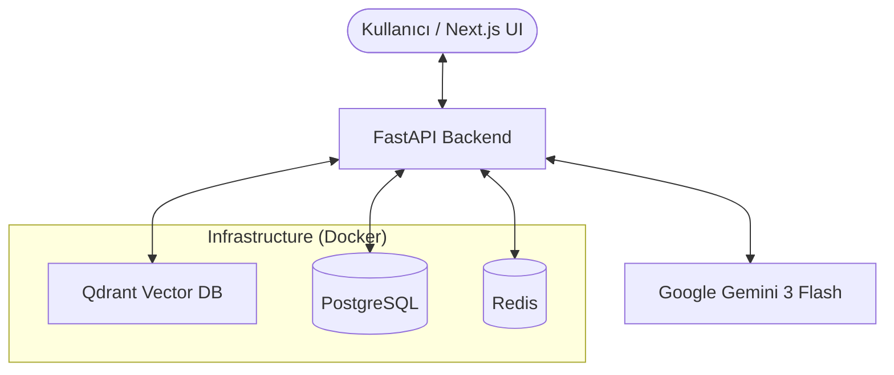

<div align="center">


# 🧠 Problem Knowledge Management (PKM)

[](https://nextjs.org/)
[](https://fastapi.tiangolo.com/)
[](https://www.docker.com/)
[](https://www.postgresql.org/)
[](https://qdrant.tech/)

**Kurumsal Hafızanızı Yapay Zeka ile Güçlendirin.**  
*Problemleri sadece çözmekle kalmayın, onları birer öğrenme fırsatına dönüştürün.*

[Kurulum Kılavuzu](#-hızlı-kurulum) • [Teknik Mimari](#-sistem-mimarisi) • [Özellikler](#-temel-özellikler)

</div>

---

## ✨ Temel Özellikler

PKM, karmaşık problemleri standart metodolojilerle çözmek ve bu çözümleri akıllı bir veritabanında saklamak için tasarlanmış uçtan uca bir platformdur.

*   **🛠️ AI Destekli Metodolojiler:** 5-Why, Ishikawa (Balık Kılçığı) ve 8D süreçlerini yapay zeka rehberliğinde yönetin.
*   **🤖 Akıllı Rehberlik:** Her adımda AI tarafından üretilen dinamik sorular ve netleştirme adımları.
*   **🔍 Semantik Arama (RAG):** Qdrant vektör veritabanı sayesinde, anahtar kelime eşleşmesi ötesinde, *anlamsal* olarak benzer geçmiş problemleri anında bulun.
*   **🎨 Premium Dark UI:** Amber ve Terracotta vurgularıyla zenginleştirilmiş, kullanıcı dostu ve profesyonel "Carbon" koyu tema.
*   **📊 Unified Record Visualization:** Tüm ekranlarda (Kayıtlar, Bilgi Bankası, Öneriler) tutarlı ve detaylı veri gösterimi.
*   **🎓 Alınan Dersler (Lessons Learned):** Her çözüm sonunda AI tarafından sentezlenen kurumsal öğrenme çıktıları.

---

## 📸 Ekran Görüntüleri

### 1. Akıllı Bilgi Bankası (Semantic Search)
Vektör tabanlı arama ile benzer problemleri benzerlik oranlarına göre listeleyin.


### 2. Detaylı Kayıt Görünümü
Problem açıklaması, kök neden analizi ve alınan derslerin hiyerarşik gösterimi.


### 3. Problem Kayıtları Yönetimi
Geçmişteki tüm vakaların durum takibi ve yönetimi.


---

## 🏗️ Sistem Mimarisi

PKM, yüksek performanslı ve modern bir teknoloji yığını üzerine inşa edilmiştir:



---

## 🚀 Hızlı Kurulum

### 1. Hazırlık
`.env.example` dosyasını `.env` olarak kopyalayın ve gerekli anahtarları ekleyin:
```bash
cp .env.example .env
```

### 2. Docker ile Çalıştır
Tüm sistemi (Backend, Frontend, Veritabanları) tek bir komutla ayağa kaldırın:
```bash
docker-compose up -d --build
```

Sistem ayağa kalktığında erişim adresleri:
- **Kullanıcı Arayüzü:** [http://localhost:3000](http://localhost:3000)
- **API (FastAPI):** [http://localhost:8000](http://localhost:8000)
- **API Dökümantasyonu:** [http://localhost:8000/docs](http://localhost:8000/docs)

### 🔑 Giriş Bilgileri (Varsayılan Admin)
*   **E-mail:** `admin@pkm.local`
*   **Şifre:** `Admin123!`

---

## 🛠️ Teknoloji Yığını

- **Frontend:** Next.js 14, React, Lucide Icons, Vanilla CSS
- **Backend:** FastAPI (Python 3.11+), SQLAlchemy
- **Yapay Zeka:** Google Gemini 1.5 Flash (LLM), Text-Embedding-004 (Vektörizasyon)
- **Veritabanı:** PostgreSQL (İlişkisel Veriler), Qdrant (Vektör Verileri)
- **Önbellek:** Redis
- **DevOps:** Docker, Docker Compose

---

<div align="center">
  <sub>Built with ❤️ for Problem Solving Excellence</sub>
</div>
