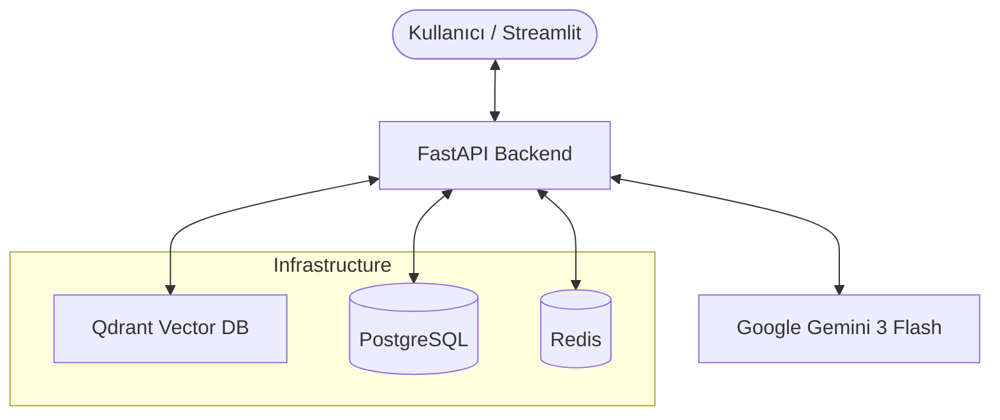

<div align="center">


# 🧠 Problem Knowledge Management (PKM)

[](https://fastapi.tiangolo.com/)
[](https://streamlit.io/)
[](https://www.docker.com/)
[](https://www.postgresql.org/)
[](https://qdrant.tech/)

**Kurumsal Hafızanızı Yapay Zeka ile Güçlendirin.**  
*Problemleri sadece çözmekle kalmayın, onları birer öğrenme fırsatına dönüştürün.*

[Kurulum Videosu](#) • [API Dökümantasyonu](API_DOCUMENTATION.md) • [Hata Bildir](#)

</div>

---

## ✨ Temel Özellikler

PKM, karmaşık problemleri çözmek ve bu çözümleri kurumsal hafızaya kazandırmak için tasarlanmış uçtan uca bir platformdur.

*   **🛠️ Standart Metodolojiler:** 5-Why, Ishikawa (Balık Kılçığı), 8D ve PDCA akışlarını AI rehberliğinde yönetin.
*   **🤖 Akıllı Rehberlik:** Gemini 3 Flash ile her adımda dinamik sorular ve yönlendirmeler.
*   **🔍 Semantik Arama (RAG):** Qdrant vektör veritabanı sayesinde, benzer geçmiş problemleri anında bulun.
*   **🎓 Otomatik Raporlama:** Oturum sonunda AI tarafından üretilen "Lessons Learned" (Alınan Dersler) raporları.
*   **🔐 Güvenli Yönetim:** JWT tabanlı kullanıcı yetkilendirme ve admin kontrol paneli.

---

## 🏗️ Sistem Mimarisi

PKM, modern ve ölçeklenebilir bir mikroservis yapısı üzerine inşa edilmiştir:



---

## 🚀 Hızlı Kurulum

Sistemi sadece birkaç dakika içinde ayağa kaldırabilirsiniz.

### 1. Hazırlık
`.env.example` dosyasını `.env` olarak kopyalayın ve **Google Gemini API Anahtarınızı** ekleyin:
```bash
cp .env.example .env
# Gemini API anahtarınızı dosyaya eklemeyi unutmayın!
```

### 2. Altyapıyı Başlat (Docker)
Backend ve veritabanlarını tek komutla çalıştırın:
```bash
docker-compose up -d --build
```

### 3. Arayüzü Başlat (Streamlit)
Lokalinizde Python paketlerini yükleyip arayüzü açın:
```bash
pip install streamlit requests
streamlit run src/frontend/app.py
```

---

## 📸 Ekran Görüntüleri

| Giriş Ekranı | Analiz Süreci | Çözüm Raporu |
| :---: | :---: | :---: |
|  |  |  |

---

## 📂 Proje Yapısı

```text
├── src/
│   ├── api/            # API Endpoints (FastAPI)
│   ├── core/           # İş Mantığı & Metodolojiler
│   ├── infrastructure/ # DB & Servis Entegrasyonları
│   └── frontend/       # Streamlit Uygulaması
├── docker-compose.yml  # Konteyner Yapılandırması
└── README.md           # Bu dosya
```

---

## 🤝 Katkıda Bulunma

1. Bu projeyi fork'layın.
2. Yeni bir feature branch oluşturun (`git checkout -b feature/YeniOzellik`).
3. Değişikliklerinizi commit'leyin (`git commit -m 'Yeni özellik eklendi'`).
4. Branch'inizi push'layın (`git push origin feature/YeniOzellik`).
5. Bir Pull Request açın.

---

<div align="center">
    Built with ❤️ by Antigravity AI
</div>
