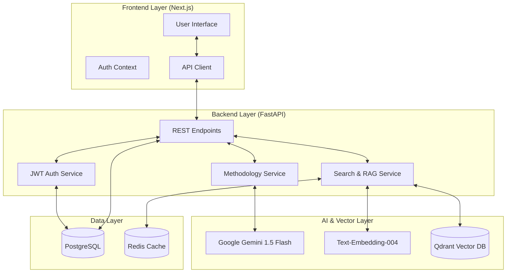

# Problem Knowledge Management (PKM)

Kurumsal süreçlerde oluşan problemleri sistematik metodolojiler ve yapay zeka desteğiyle analiz eden, çözüm süreçlerini dijital hafızaya dönüştüren bir bilgi yönetim platformudur.

---

## 🚀 Hızlı Kurulum

Sistemi Docker üzerinden tüm bileşenleriyle (Backend, Frontend, Veritabanları) tek bir adımda ayağa kaldırabilirsiniz.

### 1. Yapılandırma
`.env.example` dosyasını `.env` olarak kopyalayın ve gerekli API anahtarlarınızı tanımlayın:
```bash
cp .env.example .env
```

### 2. Sistemi Başlatma
Terminal üzerinden projenin kök dizininde aşağıdaki komutu çalıştırın:
```bash
docker-compose up -d --build
```

**Erişim Bilgileri:**
- **Uygulama Arayüzü:** [http://localhost:3000](http://localhost:3000)
- **API (FastAPI):** [http://localhost:8000](http://localhost:8000)
- **API Dökümantasyonu (Swagger):** [http://localhost:8000/docs](http://localhost:8000/docs)

**Varsayılan Yönetici Hesabı:**
- **E-posta:** `admin@pkm.local`
- **Şifre:** `Admin123!`

---

## 📌 Proje Tanımı ve Amacı

PKM, karmaşık endüstriyel problemleri çözerken oluşan "kurumsal bilgi kaybını" engellemeyi amaçlar. Standart 8D, Ishikawa ve 5-Why gibi analiz yöntemlerini yapay zeka ile dinamik bir yapıya kavuşturur. Sistemin temel amacı, bir problemin sadece o an çözülmesi değil, çözüm sürecindeki tüm mantıksal adımların anlamsal bir veritabanına (RAG) kaydedilerek gelecekteki benzer vakalarda rehberlik etmesidir.

---

## 🛠️ Temel Modüller ve Fonksiyonlar

### 1. Kimlik Doğrulama ve Güvenlik (Authorization)
Sistem, JWT (JSON Web Token) tabanlı bir yetkilendirme mekanizması kullanır. Tüm işlemler kullanıcı rolüne göre denetlenir ve her problem kaydı, oluşturan kullanıcı ile ilişkilendirilerek izlenebilirlik sağlanır.

### 2. Metodolojik Problem Analizi
Problem çözme süreci, seçilen metodolojiye (8D, Ishikawa, 5-Why) göre AI tarafından yönetilir.
- **Dinamik Yönlendirme:** Yapay zeka, kullanıcının girdiği verilere göre bir sonraki mantıksal soruyu sorarak analizi derinleştirir.
- **Döngüsel Mantık Denetimi:** Kullanıcının verdiği cevapların tutarlılığı AI tarafından kontrol edilir.

### 3. Semantik Arama ve Bilgi Bankası (RAG)
Klasik anahtar kelime aramasının ötesinde, doğal dil işleme (NLP) yetenekleriyle anlamsal eşleşmeler yapılır.
- **Anlık Benzerlik Önerileri:** Yeni bir oturum başlatıldığında, veritabanındaki benzer vakalar gerçek zamanlı olarak kullanıcıya sunulur.
- **Vektör Veritabanı:** Qdrant entegrasyonu sayesinde teknik olarak benzer problemler milisaniyeler içinde filtrelenir.

### 4. Kurumsal Öğrenme Sentezi
Analiz sonunda sistem, tüm süreci sentezleyerek otomatik olarak "Alınan Dersler" (Lessons Learned) raporu oluşturur. Bu raporlar, hiyerarşik bir görünümde (Unified Record Detail) incelenebilir.

---

## 📸 Ekran Görüntüleri


| Modül | Açıklama ve Görsel |
| :--- | :--- |
| **Kullanıcı Girişi** | Güvenli JWT tabanlı erişim kontrolü.|
| **Problem Analizi** |  AI destekli adım adım metodoloji yönetimi ve dinamik soru akışı.|
| **Kayıt Detayı** |  AI’nin problemi analiz etmesi ve geçmişteki benzer sorunları önermesi.|
| **Bilgi Bankası** |  Vektör tabanlı anlamsal arama, benzerlik skorları ve gelişmiş filtreleme. |


---

## 🏗️ Teknik Mimari

Projenin veri akışı ve bileşenler arası iletişimi aşağıda görselleştirilmiştir:



### Teknoloji Yığını
- **Frontend:** Next.js 14, TypeScript, Vanilla CSS
- **Backend:** FastAPI (Python), SQLAlchemy
- **Yapay Zeka:** Google Gemini 1.5 Flash (LLM), Text-Embedding-004
- **Vektör DB:** Qdrant (Hızlı anlamsal arama)
- **İlişkisel DB:** PostgreSQL (Kayıt yönetimi)
- **Önbellek:** Redis (Hızlı arama sonuçları)

---
<div align="center">
  <sub>Problem Knowledge Management • 2026</sub>
</div>
